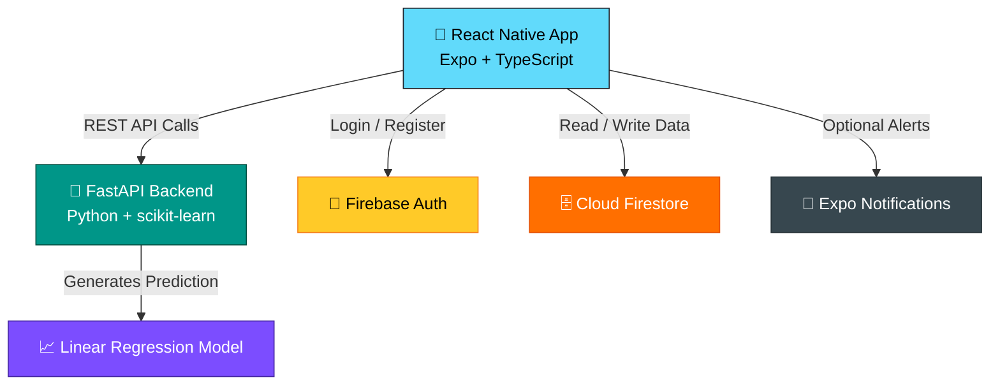

<div align="center">

<!-- Animated Header -->


<!-- Animated Logo / GIF -->


<br/>

<!-- Typing Animation -->
<a href="https://git.io/typing-svg">
  
</a>

<br/><br/>

<!-- Badges -->
[](https://reactnative.dev/)
[](https://www.typescriptlang.org/)
[](https://firebase.google.com/)
[](https://fastapi.tiangolo.com/)
[](https://expo.dev/)
[](LICENSE)

<br/>

[](https://github.com/LuthandoCandlovu/StudyMateAI)
[](https://github.com/LuthandoCandlovu/StudyMateAI)
[](https://github.com/LuthandoCandlovu/StudyMateAI/issues)

</div>

---

## 🌟 What is StudyMate AI?

> **StudyMate AI** is a smart, beautifully designed mobile app built for students who want to take their academics seriously — and actually *see* results.

Most students struggle not because they're not smart, but because they lack **structure**, **visibility**, and **motivation**. StudyMate AI solves all three:

- 📌 **Structure** — Set target study hours per subject and log your daily progress
- 📊 **Visibility** — Visualise your performance with real-time charts and streak tracking
- 🤖 **Motivation** — Receive AI-generated predictions and personalised advice based on your last 7 days of study data

Whether you're cramming for finals or building long-term learning habits, StudyMate AI keeps you on track — one session at a time.

<div align="center">
  
</div>

---

## ✨ Features at a Glance

<div align="center">

| Feature | Description |
|--------|-------------|
| 🔐 **Authentication** | Secure email/password login via Firebase Auth |
| 📚 **Subject Management** | Add subjects with personalised target study hours |
| ⏱️ **Study Logging** | Record daily study hours per subject |
| 📊 **Progress Charts** | Bar charts comparing completed vs target hours |
| 🔥 **Study Streaks** | Track consecutive days of study activity |
| 🤖 **AI Predictions** | FastAPI + scikit-learn predicts future performance |
| 💡 **Smart Advice** | Personalised tips based on your progress patterns |
| 🔔 **Reminders** | Push notifications when you're falling behind |

</div>

---

## 🏗️ Architecture



### 🔄 Data Flow

```
1. 🔐  User logs in          →  Firebase Auth validates credentials
2. 📚  Adds subject          →  Data stored in Firestore (per-user collection)
3. ⏱️  Logs study hours      →  Firestore updated with daily session
4. 🏠  Opens Home screen     →  App fetches progress & streak data
5. 🤖  AI prediction         →  Last 7 days sent to FastAPI → model returns score + advice
6. 🔔  Falls behind          →  Local notification triggered if progress < 50%
```

---

## 📱 Screenshots

<div align="center">

| Login | Home | Add Subject | Log Hours | AI Prediction |
|-------|------|-------------|-----------|---------------|
|  |  |  |  |  |

</div>

---

## 🛠️ Tech Stack

<div align="center">

| Layer | Technology |
|-------|-----------|
| **Frontend** | React Native (Expo), TypeScript, React Navigation, Axios |
| **Backend** | Python, FastAPI, Uvicorn, scikit-learn, Pandas, NumPy |
| **Database** | Cloud Firestore (NoSQL) |
| **Auth** | Firebase Authentication (Email/Password) |
| **Charts** | react-native-chart-kit, react-native-svg |
| **Notifications** | Expo Notifications (optional) |

</div>

---

## 🚀 Getting Started

<details>
<summary><b>📋 Prerequisites</b></summary>

<br/>

- ✅ Node.js (v18+)
- ✅ npm or yarn
- ✅ Expo CLI → `npm install -g expo-cli`
- ✅ Python 3.9+ (for the backend)
- ✅ A Firebase project (free tier is fine)

</details>

<details>
<summary><b>⚙️ Installation</b></summary>

<br/>

**1. Clone the repository**

```bash
git clone https://github.com/LuthandoCandlovu/StudyMateAI.git
cd StudyMateAI
```

**2. Install frontend dependencies**

```bash
npm install
# or
yarn install
```

**3. Configure Firebase**

- Create a Firebase project at [console.firebase.google.com](https://console.firebase.google.com)
- Enable **Email/Password** authentication
- Create a **Firestore** database in test mode
- Replace `firebaseConfig` in `src/config/firebase.ts` with your credentials

**4. Run the mobile app**

```bash
npx expo start --clear
```

> Scan the QR code with **Expo Go** or launch on an emulator.

**5. Start the AI backend**

```bash
cd backend
python -m venv venv
source venv/bin/activate   # Windows: venv\Scripts\activate
pip install fastapi uvicorn scikit-learn pandas numpy
uvicorn main:app --reload --port 8000
```

**6. Start studying! 🎉**

- Register → Add a subject → Log your hours → See your AI prediction

</details>

---

## 📂 Project Structure

```
StudyMateAI/
├── 📁 src/
│   ├── 📁 config/          # Firebase configuration
│   ├── 📁 screens/         # Login, Register, Home, AddSubject, AddStudyHours
│   ├── 📁 components/      # ProgressChart component
│   ├── 📁 navigation/      # Stack navigator setup
│   ├── 📁 services/        # Firestore CRUD + streak logic
│   └── 📁 types/           # TypeScript interfaces
├── 📁 backend/
│   └── main.py             # FastAPI prediction endpoint
├── 📁 assets/              # Icons and splash screen
├── App.tsx
├── package.json
└── README.md
```

---

## 🔮 Roadmap

<div align="center">

| Status | Feature |
|--------|---------|
| ✅ Done | Study streak tracking |
| ✅ Done | AI performance prediction (linear regression) |
| ⏳ Planned | Advanced ML with subject difficulty + past scores |
| ⏳ Planned | Social leaderboards — compete with friends |
| ⏳ Planned | Voice logging — add hours via speech |
| ⏳ Planned | Dark mode toggle |
| ⏳ Planned | Export progress report as PDF |

</div>

---

## 🤝 Contributing

Contributions are warmly welcome! 🙌

```bash
# Fork → Create branch → Commit → Push → Open PR
git checkout -b feature/your-feature-name
git commit -m "feat: add amazing feature"
git push origin feature/your-feature-name
```

Please open an [issue](https://github.com/LuthandoCandlovu/StudyMateAI/issues) first for major changes.

---

## 📄 License

This project is open source under the [MIT License](LICENSE).

---

## 🙏 Acknowledgements

- [React Native](https://reactnative.dev/) — Mobile framework
- [Expo](https://expo.dev/) — Build toolchain
- [Firebase](https://firebase.google.com/) — Auth & database
- [FastAPI](https://fastapi.tiangolo.com/) — Backend framework
- [scikit-learn](https://scikit-learn.org/) — ML model

---

<div align="center">


**Built with ❤️ by [Luthando Candlovu](https://github.com/LuthandoCandlovu)**

*If this project helped you, consider giving it a ⭐ — it means a lot!*

[](https://github.com/LuthandoCandlovu)

</div>
